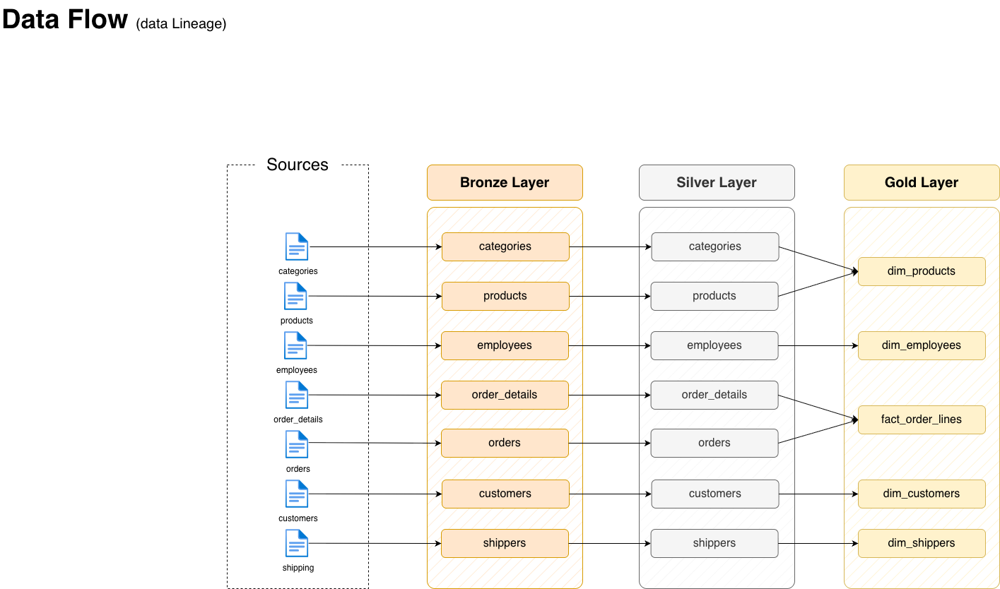
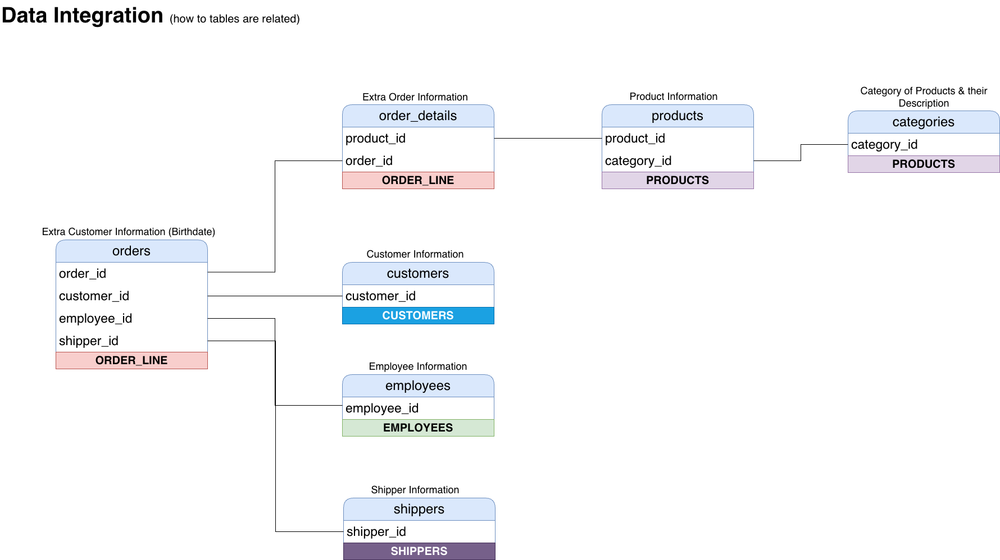
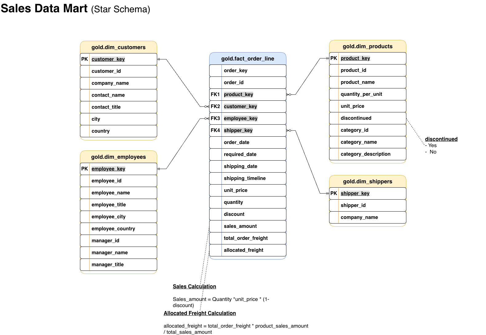
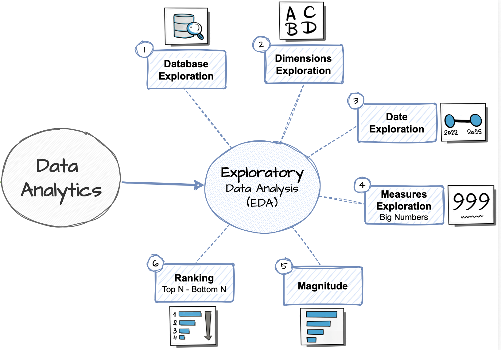

# Northwind Data Warehouse and Exploratory Data Analysis Using SQL

<p align="left">
  
  
  
  
  
  
</p>

## Project Overview

This project builds an end-to-end analytics solution using the Northwind dataset and Microsoft SQL Server. Raw CSV files are loaded into a **Bronze–Silver–Gold data warehouse**, transformed into an analytics-ready star schema, validated through data-quality checks and analysed using SQL.

The repository contains two connected parts:

- [`Northwind_Data_Warehouse`](Northwind_Data_Warehouse) – builds and validates the warehouse.
- [`Northwind_EDA`](Northwind_EDA) – explores the Gold layer and produces business insights.

## Project Objectives

- Build a structured SQL Server data warehouse from raw CSV files.
- Automate ingestion and transformation with stored procedures.
- Clean, standardise and validate the source data.
- Create a dimensional model for reporting and analysis.
- Calculate sales, order, customer, employee and shipping KPIs.
- Identify top-performing and underperforming business segments.

---

## End-to-End Data Flow



```text
CSV Source Files
       ↓
Bronze Layer — Raw ingestion
       ↓
Silver Layer — Cleaning and standardisation
       ↓
Gold Layer — Business-ready star schema
       ↓
SQL EDA — Measures, comparisons and rankings
       ↓
BI and Reporting
```

---

## Data Warehouse Architecture

### Bronze Layer

The Bronze layer stores raw or near-raw source data. CSV files are loaded with `BULK INSERT`, tables are truncated before full reloads, and stored procedures record load durations and errors.

Main scripts:

- [`ddl_bronze.sql`](Northwind_Data_Warehouse/scripts/bronze/ddl_bronze.sql)
- [`s_proc_load_bronze.sql`](Northwind_Data_Warehouse/scripts/bronze/s_proc_load_bronze.sql)

> Customer and product files required an alternative import approach because embedded commas and special characters affected CSV parsing.

### Silver Layer

The Silver layer prepares clean and consistent relational tables by:

- Removing carriage returns, line feeds, quotes and extra spaces.
- Standardising categorical values.
- Handling selected missing values.
- Converting columns to suitable data types.
- Validating dates, prices, quantities and discounts.

Main scripts:

- [`ddl_silver.sql`](Northwind_Data_Warehouse/scripts/silver/ddl_silver.sql)
- [`s_proc_load_silver.sql`](Northwind_Data_Warehouse/scripts/silver/s_proc_load_silver.sql)

### Gold Layer

The Gold layer exposes analytics-ready dimension and fact views. It includes surrogate keys, employee-manager relationships, shipping classifications, calculated sales and freight allocated to individual order lines.

Main script:

- [`nw_ddl_gold.sql`](Northwind_Data_Warehouse/scripts/gold/nw_ddl_gold.sql)



---

## Gold-Layer Data Model



| View | Description |
|---|---|
| `gold.dim_customers` | Customer, company and geographic information |
| `gold.dim_products` | Product, category, price and status information |
| `gold.dim_employees` | Employee, title, location and manager information |
| `gold.dim_shippers` | Shipping-company information |
| `gold.fact_order_line` | Order-line dates, quantities, discounts, sales, freight and shipping outcomes |

### Fact-Table Grain

`gold.fact_order_line` contains **one row per order and product combination**. One order may therefore appear on several rows.

```sql
COUNT(*)                    -- Order lines
COUNT(DISTINCT order_id)    -- Unique orders
SUM(quantity)               -- Units sold
```

Using the correct grain prevents orders containing several products from being counted more than once.

---

## Data Quality and Validation

The project checks for:

- Duplicate business keys and order-product combinations.
- Null values and unmatched dimension relationships.
- Leading or trailing spaces.
- Invalid categorical values and date formats.
- Incorrect prices, quantities, discounts and sales calculations.
- Freight-allocation differences.
- Record-count differences between Silver and Gold.

Validation scripts:

- [`quality_checks_silver_layer.sql`](Northwind_Data_Warehouse/tests/quality_checks_silver_layer.sql)
- [`nw_quality_checks_gold_layer.sql`](Northwind_Data_Warehouse/tests/nw_quality_checks_gold_layer.sql)

---

## Exploratory Data Analysis

The EDA section uses the Gold-layer model to examine the dataset, calculate KPIs and rank performance.



| Stage | Script | Purpose |
|---:|---|---|
| 1 | [`01_nw_database_exploration.sql`](Northwind_EDA/scripts/01_nw_database_exploration.sql) | Inspect schemas, tables and columns |
| 2 | [`02_nw_dimension_exploration.sql`](Northwind_EDA/scripts/02_nw_dimension_exploration.sql) | Review unique dimension values |
| 3 | [`03_nw_date_range_exploration.sql`](Northwind_EDA/scripts/03_nw_date_range_exploration.sql) | Determine historical coverage |
| 4 | [`04_nw_measure_exploration.sql`](Northwind_EDA/scripts/04_nw_measure_exploration.sql) | Calculate core measures and shipping KPIs |
| 5 | [`05_nw_magnitude_analysis.sql`](Northwind_EDA/scripts/05_nw_magnitude_analysis.sql) | Compare performance across dimensions |
| 6 | [`06_nw_ranking_analysis.sql`](Northwind_EDA/scripts/06_nw_ranking_analysis.sql) | Identify top and bottom performers |

A saved measure summary is available in [`summary_EDA_measure_analysis.pdf`](Northwind_EDA/docs/summary_EDA_measure_analysis.pdf).

---

## Key Results

The dataset covers **4 July 2013 to 6 May 2015**.

| Measure | Result |
|---|---:|
| Total sales | **$1,265,793.29** |
| Unique orders | **830** |
| Order lines | **2,155** |
| Units sold | **51,317** |
| Average order value | **$1,525.05** |
| Customers | **91** |
| Products | **77** |
| Product categories | **8** |
| Employees | **9** |
| Shipping companies | **3** |
| Completed shipping outcomes | **809 orders** |
| Shipped early or on time | **772 orders** |
| On-time shipping rate | **95.43%** |
| Delayed shipping rate | **4.57%** |

> Shipping rates use unique orders with a completed shipping outcome. The 21 orders classified as `N/A` are excluded because they do not have a completed shipping result.

### Selected Findings

- **Côte de Blaye** was the highest-selling product at **$141,396.74**.
- **Beverages** was the leading category at **$267,868.20**.
- **Margaret Peacock** generated the highest employee-attributed sales at **$232,890.89**.
- **QUICK-Stop** was the highest-value customer at **$110,277.32**.
- The **USA** was the leading market at **$245,584.65**.
- **United Package** handled the highest sales value at **$533,547.74**.

---

## Repository Structure

```text
NorthWind-Data-Warehouse-And-EDA-Project-SQL/
├── Northwind_Data_Warehouse/
│   ├── datasets/
│   ├── docs/
│   ├── scripts/
│   │   ├── bronze/
│   │   ├── silver/
│   │   └── gold/
│   ├── tests/
│   └── README.md
├── Northwind_EDA/
│   ├── datasets/
│   ├── docs/
│   ├── scripts/
│   └── README.md
├── LICENSE
└── README.md
```

---

## Skills and Technologies

<p align="left">
  
  
  
  
  
  
  
  
  
  
</p>

This project demonstrates SQL development, ETL design, data cleaning, dimensional modelling, stored procedures, error handling, data-quality testing, aggregate analysis, conditional logic, window functions and technical documentation.

---

## How to Run the Project

### Prerequisites

- Microsoft SQL Server.
- SQL Server Management Studio, Azure Data Studio or another SQL Server client.
- File permissions that allow SQL Server to access the source CSV files.

### 1. Clone the Repository

```bash
git clone https://github.com/petertakyio-stack/NorthWind-Data-Warehouse-And-EDA-Project-SQL.git
cd NorthWind-Data-Warehouse-And-EDA-Project-SQL
```

### 2. Update the Source Paths

Copy the CSV files to a SQL Server-accessible location and update the paths in:

```text
Northwind_Data_Warehouse/scripts/bronze/s_proc_load_bronze.sql
```

### 3. Build the Warehouse

Run the following in order:

1. `init_database.sql`
2. Bronze DDL and loading procedure
3. `EXEC bronze.load_bronze;`
4. Silver DDL and loading procedure
5. `EXEC silver.load_silver;`
6. Silver quality checks
7. Gold DDL
8. Gold quality checks

### 4. Run the EDA

After validating the Gold layer, run the six EDA scripts in numerical order.

---

## Potential Extensions

- Build a Power BI dashboard from the Gold layer.
- Add monthly and yearly sales trends.
- Segment customers by value, frequency and recency.
- Analyse repeat purchases and retention.
- Compare product profitability after discounts and freight.
- Add incremental loading and pipeline audit tables.

---

## 👨🏽‍💻 About Me

Hi, I’m **Peter Takyi Ohemeng** — a **petroleum engineer and environmental management professional** building strong expertise in **data analytics, business intelligence, and data engineering**.

🌍 I aspire to become an **environmental data analyst**, using data to identify environmental risks, improve operational performance, and support smarter decision-making across the energy and extractive industries.

⚙️ I am particularly interested in finding the right balance between resource development and environmental responsibility. My long-term goal is to help organisations derive the safest and fullest possible benefits from extractive activities while protecting the environment and the communities that depend on it.

📊 Through projects like this, I am developing practical skills in **SQL, data warehousing, dimensional modelling, ETL development, and analytics reporting** — transforming raw data into reliable insights that support better business and environmental decisions.

> 🌱 **My mission:** To combine engineering knowledge, environmental awareness, and data-driven insights to contribute to a safer, smarter, and more sustainable future.

---

## License

This project is licensed under the [MIT License](LICENSE).
You are free to use, modify, and share this project with proper attribution.

---
